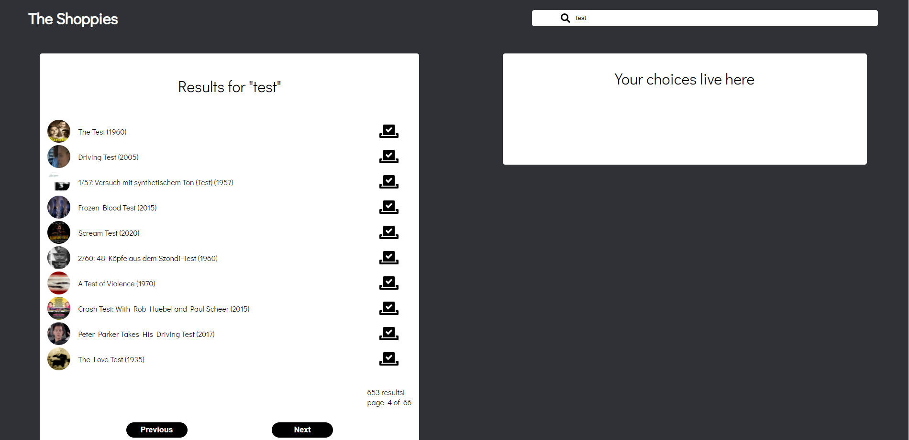
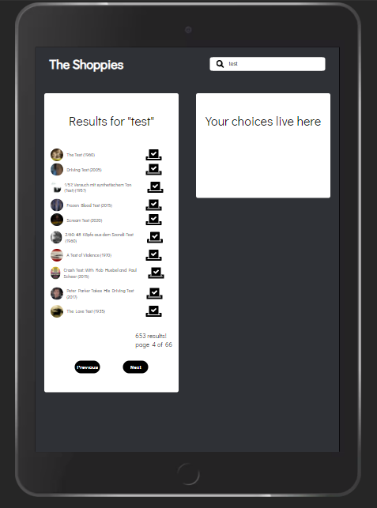
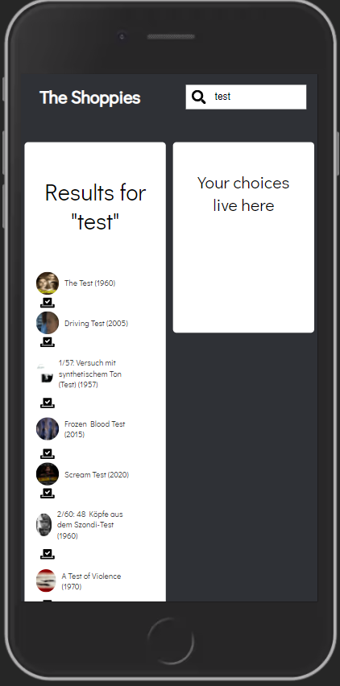
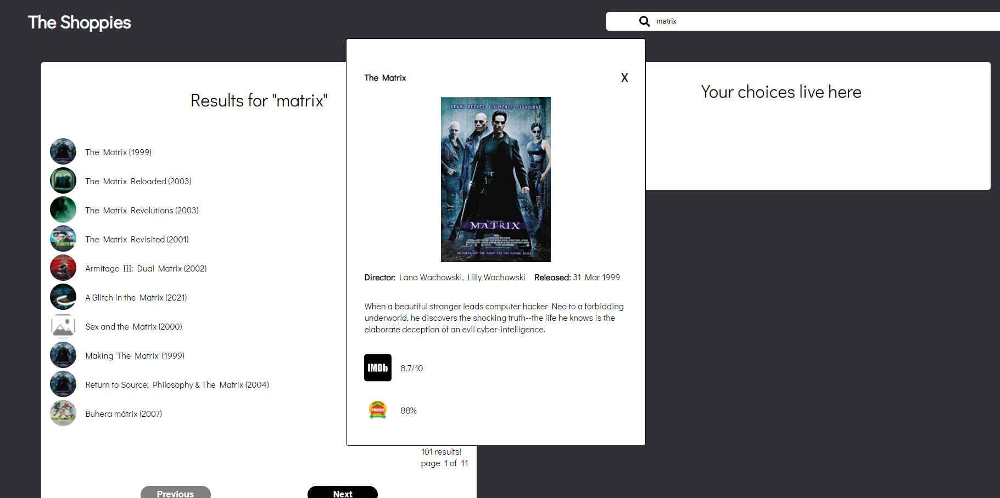

# And the Shoppy goes to...(fingers crossed)

This project was completed in support of my application to the Shopify front-end developer internship. 

Link to the live demo: [The Shoppy awards](https://shoppies-omar.netlify.app/)

For a local copy, clone this repo, jump into the folder and run 'npm install' to get all dependencies installed. 'npm start' to run.

## The Thing
I used React because I'm relatively comfortable with it and wanted to spin something up quickly. My goal for this project was to try and implement as much as I could from scratch but I did end up using three packages.
* [Axios](https://www.npmjs.com/package/axios): I used this for my http calls. I just really like the syntax as opposed to fetch calls.
* [node-sass](https://www.npmjs.com/package/node-sass): css pre processor for styling. I wanted to experiment with SCSS and with BEM techniques. No real reason to use a css preprocessor here besides experimentation. I've tried it before and did find that it made things like media queries a lot easier to implement.
* [use-debounce](https://www.npmjs.com/package/use-debounce): I definitely wanted to implement debouncing for my movie search. Since I was listening to the users keystrokes and potentially firing an API call on every change, I thought it would make sense to wait a bit and let them type a chunk before making the call. Instead of doing this from scratch I went for a tried and tested tool.

My first iteration of the app was quite straightforward. It looked just like the image in the scope document (i.e. rather plain) but it did the basic things required. Search, nominations (and the appropriate rules around that), and finally removing a nominated film. Then I decided to implement a basic cache using localstorage. This allows the app to 'remember' your nominations and populate the app upon loading.

I then moved to styling the app. Perhaps this is overkill for this project but I decided to get as responsive as possible. The app looks _decent_ on most screen sizes. Since I decided to go responsive a bit later, this was hard. Ideally, I'd have started with a mobile-first approach, making it a bit easier for me to just add things to the screen, however I did decide to just get the app built and that made the responsive piece a bit mor challenging than it should have been. Nevertheless, I'm happy with it. Here are some screenshots at different sizes. Could the mobile styling be better? Totally. But again, for now, I'm happy with it.

### Desktop

### Tablet

### Mobile

These are all live, so please check them out if you'd like :)

## Extra stuff? A little bit.
The brief suggested we try adding new features. In fact, adding a caching system was a suggested extra, so there's that. I added a couple of teeny css animations to the buttons when adding and removing nominations. Also, I added a modal that gives you additional information on a film when you click on the name. Here's what it looks like.

## Trade-offs/Miscellaneous Thoughts
* State management was something I thought about when I was planning out how I'd build this project. I thought that using a library like Redux would be overkill for what I wanted to accomplish. It was just fine passing state around as props, given the limited scope of this app. Were I to build something a bit more complex, then yes, I'd opt for some tool to help with centralizing state.
* Like I said, I did implement debounce but used a library for it. I'd do it from scratch next time beacause it's not that much code to get it done.
* From a design perspective I had a few ideas for both the mobile and the desktop versions of the app but I wanted both to have the same functionality and didn't want to spend too much time agonizing over responsiveness. I understand that may not have been in-scope for the assignment, but it's fun using the deployed app on the phone as I lie in bed at 3 am trying to sleep but not being able to.
